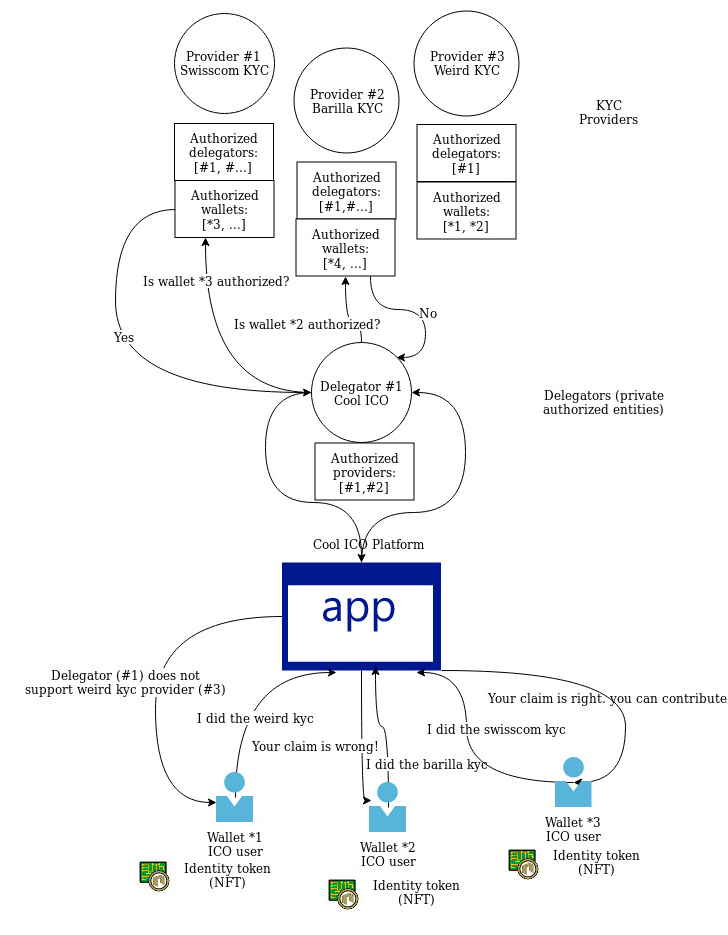

# NEO ClaimEngine

A decentralized identity standard based on the NEO blockchain, compatible with real-world centralized systems.  

This concept is aimed at simplifying IDs and licenses checks, ICOs and public token sale processes (KYC/AML), as well as individual properties.

It is composed by two Smart Contracts and an Identity Token:

* The Identity Provider Smart Contract

  * Owned by the actual authorities (Civil register office, state authority for motor vehicles, etc.)

  * Maintains a list of authorized delegators and a list of authorized wallets (which owns a certain claim)

* The Delegator Smart Contract

  * Owned by authorized private entities (KYC providers, banks, local associations, etc.)

  * Maintains a list of authorized providers, which will be called to verify a claim (the delegator must be in the provider's authorized delegators list)

* The Identity Token (IDK), a Non Fungible Token that represents a specific claim

## Possible practical use cases

1. **A Police officer cought a man speeding:**

   1. He is being requested to show licence and registration.

   2. He has a registration in bern, but he only has a bad registration.

   3. He tries to claim he has a bernese driving licence (which is true).

   4. He tries to claim he has a good registration (which is false).

2. **People want to invest in the cool ICO:**

   1. To Invest, they must pass KYC.

   2. Luckily, the ICO supports certain KYC providers.

